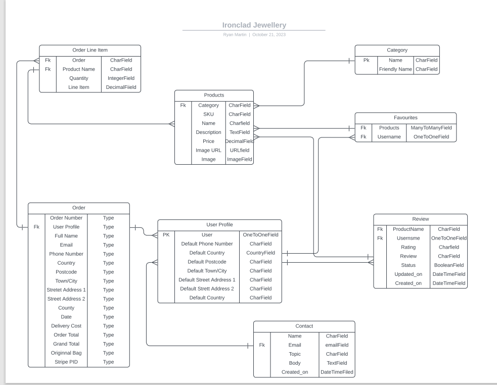

<h1 align="center">Ironclad Jewellery</h1>

### **Live Site**
[Ironclad Jewellery Live Site](https://ironclad-jewellery.herokuapp.com/)

### **Repository:**
[Ironclad Jewellery Repository](https://github.com/Ryan-Martin22/ironclad-jewellery)

# About
This is a full-stack e-commerce project built using Django, Python, HTML, CSS, and JavaScript. I have created this website for 'Ironclad', a business that sells a range
of Men's Jewellery of all differnt stylings, including gold,silver and stainless steel. This site exclusively sells rings and bracelets. 

# User Experience

# Strategy

This website is for a Business to Consumer (B2C) business that sells stylish men's jewellery. The target market for these products are:

- Men who enjoy fashion and in particular, mens's jewellery.
- Those looking for gifts or presents for people who enjoy wearing jewellery.
- Men aged between 15 and 60.

Keeping the above in mind, I believe the Customers will need a website that is:

- Easy to Navigate and filter/search by category.

- Has the ability to view and purchase items.

- Has an email subscription service.

- Has links to Social Media sites Facebook and Instagram.

- User Account functionality, to keep track of order history and store delivery information.

And the Owner will need a website that:

- Appealingly displays their products.

- Allows them to add, edit and remove products.

- Allows customers to get in contact if required through a contact form.

- Allows user to share feedback through reviews on products in order to improve products/service.

# User Stories

Please find my Projects Board with my user stories [here](https://github.com/users/Ryan-Martin22/projects/6). Below is a detailed list of User Stories per User Type.
## Superuser / Admin
1.	As a Site Owner I want to be able to add a product so that I can add more items to my store to increase revenue.
2.	As a Site Owner I want to be able to Edit/Update a product so that I can change the price, description, and other product criteria if any changes were to occur.
3.	As a Site Owner I want to be able to delete a product so that I can remove items that are no longer available.
4.	As a Site Owner I want to be able to send emails to customers with a subscription, notifying customers of any deals, sales, and new arrivals.
5.	As a Site Owner, I want to be able to remove reviews from a product if the review is derogatory to the nature of the site.
6. As a Site Owner I want customers to be able to contact me about any issues by filling out a contact form.  

## Shopper
1.	As a Shopper I want to be able to view a list of items so that I can add them to my basket to purchase.
2.	As a shopper I want to be able to click into an item so that I can view a product description and add it to the basket.
3.	As a shopper I want to be able to add items to my basket so that I can keep track of what I am spending.
4.	As a shopper I want to be able to adjust the quantity of products in my basket so that I can make changes to my purchases before checkout.
5.	As a shopper I want to be able to enter payment information so that I can check out and purchase my product with ease.
6.	As a shopper I want to be able to feel that my personal and payment details are safe and secure so that I can confidently carry out my purchase.
7.	As a shopper I want to be able to view an order confirmation so that I can verify my order is correct.
8.	As a shopper I want to be able to receive an email confirmation of my order so that I have proof of my order for my records in case of any delivery delay.
9.	As a shopper I want to be able to order without creating an account so that I can make one-off orders.
10.	As a shopper I want to be able to sort a specific category of products so that I can find the exact style/type of product that suits me.
11.	As a shopper I want to be able to sort multiple categories and products simultaneously so that I can find the best-priced product over a broader range of categories
12.	As a shopper I want to be able to easily see what I’ve searched for and the number of results so that I can quickly see whether the product is available.
13.	As a shopper I want to be able to easily register for an account so that I can have a personal account and view my profile and purchase history.
14.	As a shopper I want to be able to receive a registration confirmation email so that I can confirm registration.
16.	As a shopper I want to be able to sign up for emails so that I can be notified of new releases, deals, and upcoming sales.
17. As a shopper, I want to be able to be able to contact the site owner so that I can ask about my order or for further information not on the site or social media.
18. As a shopper, I want to be able to be able to review products purchased on the site so I can share my thoughts with other shoppers and the business.
19. As a shopper, I want to be able to be able to edit and remove my reviews of products purchased so I can share or remove my reviews if my opinions change.
20. As a shopper I would like to save items so that I can return to them to purchase later.

# Scope

To achieve the above user and business goals, this project will be created with the following features:

- Site Navigation containing a Search Bar, My Account Links, Shopping Bag links, Contact Us form and Product Categories sections.

- A Landing Page that clearly demonstrates what the site is for.

- A Products Page that lists the Products contained within the category/search carried out.

- Products Cards that gives the user an image of the product along with name, price, and ability to click into it for more details.

- Registration/login functionality using Django AllAuth so that users can create and manage their account.

- A User Profile Page so that users can save delivery details for faster orders in future and to see their order history.

- Custom 404 Error Page

# Structure

This project is structured with a homepage that greets the user with a clear navigation bar at the top of the page to search for the item required or to browse all products. There is the ability to sort items by price, alphabetically, and by category as well as the ability to search for a product by typing keywords into the search bar.

The website is made of the following apps:
1. Home
2. Products
3. Profile
4. Bag
5. Checkout
6. Contact
7. Favourites

## Database Models 

### Category

The Category model is required so that the site owner can assign products to a Category. This model allows for filtering functionality so that shoppers can search for items wanted by item type, new arrivals, clearance, and deals.

### Products
The Products model is required to add products for sale to the site. The site owner only can add, edit, and delete products from here and all users can view the full product list on the site.

### Order & Order Line Items
The Order model holds the order details of an order placed by the shoppers. This is connected to the Order Line Items model which contains the products ordered by the shopper.

### User Profile

The User Profile contains delivery information for those who created an account and chose to store their delivery details for faster checkout.

### Favourites

The Favourites model is required for users to add products to their favourites so they can come back to purchases them later.

### Contact

The Contact model enables users to provide information in order for them to contact the store owner about a specific query. 

### Review 

The reviews database holds all of the reviews submitted by users with an account. Users can submit, edit and delete reviews posted by themselves whilst logged in to their accounts. This is accessible via the Product Details page for the products they have reviewed.

## ERD Diagram 

The Entity-Relationship Diagram below shows how the database models relate to each other:

## Wireframes

All wireframes were created using [Balsamiq](https://balsamiq.com/).

Ironclad Jewellery Wireframes for Mobile and Desktop devices can be viewed in the wirefames folder within the assets folder [here](assets/documents/wireframes.pdf).

# Marketing Strategies

The following questions were asked and answered when trying to decide on the best marketing strategy. 

1.	Which online platforms would you find lots of your users?

- Facebook
- Instagram
- Tiktok
- pinterest
- Twitter

2.	Would your users use social media? If yes, which social media platforms do you think you would find them on?

- Facebook
- Instagram
- Tiktok
- Twitter

3.	What do your users need? Could you meet that need with useful content? If yes, how could you best deliver that content to them?

- Style Inspiration: 
    - Facebook Posts of our jewellery styled and possible combinations with oufits for occasions
    - TikTok Videos following current editing trends
- Gift Inspiration
    - Facebook/Instagram Posts of gift ideas and product combinations
    - Emails with gift ideas, particularly around Fathers Day, Christmas and International Men's Day.

4.	Would your business run sales or offer discounts? How do you think your users would most like to hear about these offers?

- Email deals for subscribers who sign up to the newsletter
- Sale Emails and Facebook Posts/Stories

5.	What are the goals of your business? Which marketing strategies would offer the best ways to meet those goals?

- Make Sales
- Monthy site viewing targets
- Gather repeat customers
- Target of account sign-ups

6.	Would your business have a budget to spend on advertising? Or would it need to work with free or low-cost options to market itself?

- Free/low-cost marketing as the budget would need to go towards aquiring more stock and potentially high end pieces.

I also looked at the below business as they both also sell stylish jewellery for men, Instagram is the most popular site followed by Facebook. 

### Craftd London: 
FB Page 51,703 likes, Instagram 383k followers

### Indigo Sands: 
FB Page 65,036 likes, Instagram 379K followers

### Facebook

### Subscription

Users are also able to subscribe to receive the Clay & Fire Jewellery Newsletter via the Mailchimp form found in the footer. Subscription email would contain Upcoming Sale information and current deals. 

# Features

## Homepage

### Logo / Shop Name

### Search Bar 

### My Account 

### Shopping Bag 

### Bootstrap Toast

### Product Navigation

### Homepage and Delivery Banner

## My Account

### Account Registration

### Login

### My Profile

- Delivery Information

- Order History

- Order Confirmation

### Logout

## Products Page 

## Product Details 

## Product Favourited 

## Product Review

Visable on the bottom of the Product Details Page

## Edit Review Form

## Delete Review Confirmation

## Shopping Bag

## Checkout

## Checkout Success

## Footer

## Company
### About Us

### Privacy Policy

## Contact Form

### Edit Products

### Delete Products

## Colour Scheme 

The colour scheme for the project was put together using [Adobe Color](https://color.adobe.com/create/image) by uploading the landing page image.

The colour scheme is also based of the Boutique Ado walkthrough.

## Font Choice

I chose the Google Font Castoro Titling to act as the primary font for the website, including for the logo.

# Features to be Implemented
The following features can be implemented to enhance the project:

- This weeks featured items for promotion on the homepage
- Implementation of a monthly discount coupon for subscribed shoppers.
- Returns Functionality

# Technologies Used
## Languages Used

[html](https://en.wikipedia.org/wiki/HTML)

[CSS](https://en.wikipedia.org/wiki/CSS)

[Python](https://www.python.org/)

[JavaScript](https://www.javascript.com/)

## Frameworks, Libraries, and Programmes Used 

[GitHub](https://github.com/) - Holds the repository of my project, GitHub connects to GitPod and Heroku.

[GitPod](https://gitpod.io/workspaces) – Connected to GitHub, GitPod hosted the coding space, allowing the project to be built and then committed to the GitHub repository. 

[Heroku](https://www.heroku.com/) - Connected to the GitHub repository, Heroku is a cloud application platform used to deploy this project so the backend language can be utilised/tested. 

[Django](https://www.djangoproject.com/) - This framework was used to build the foundations of this project, reducing time spent getting the project setup and preventing re-writing existing code.

[Bootstrap](https://getbootstrap.com/) - Used to quickly add design and responsiveness to my website, Bootstrap focuses on mobile first design meaning this website is responsive across multiple devices and screen sizes.

[Font Awesome](https://fontawesome.com/) - Used for all of the icons throughout the site.

[Image Compressor](https://imagecompressor.com/) - Used to compress the website and product images.

# Testing
## **Manual Testing by User Story**
### **Superuser / Admin**
### 1. As a Site Owner, I want to be able to add a product so that I can add more items to my store.
- Products can be added both via the project management page found by clicking on 'My Account' or vis the Admin Panel. Both types of product adding were tested and the products were both visable in the model and on the Products Page.

The following was also checked and found to be working as expected when the product was added:

- The required fields are validating correctly and error messages are explicit and related to each required field.
- All required fields are indicated with an asterisk.
- Number fields can only contain numbers.
- Images can be left out and a placeholder image takes its place.
- Images, when uploaded, are stored in the appropriate Amazon Web Services Bucket and Folder.
- Buttons are highlighted on hover and take the user to the correct page:
    - Cancel takes the user back to the Products Page
    - Add product add the product and returns the user to the Products Page
- An alert message appears in the top right of the page to notify the user that the product has successfully been added.

### 2.	As a Site Owner, I want to be able to Edit/Update a product so that I can change the price, description, and other product criteria.

The below was tested by editing an existing product:

- Edit buttons are located on the product cards on the products page which are only accessible if you are a Superuser. 

I also attempted to edit products whilst signed in as a generic user. The edit button on the Product Cards weren't available and I was unable to sign into the Admin Panel.

- Clicking the Edit button takes the user to the product form which is already populated with the current information. I double checked this information matched the product I intended to edit, which it did. 
- The fields are validated the same way as if a new product was being added, all number fields must be numbers and required fields filled in. Error messages appeared as I attempted to input incorrect information and the form would not submit.
- Removing the image was tested and the placeholder image will replaced it upon saving as expected.
- If the image is replaced with a new image it is stored in the correct Amazon Web Services Bucket and Folder.
- The name of the image uploaded can be the same as an image that exists.
- An alert message appears in the top right of the page to notify the user which product they are currently editing. This matched the product name that was populated within the edit form.
- Buttons are highlighted on hover and take the user to the correct page:
    - Cancel takes the user back to the Products Page.
    - Update product saves the updated product information and returns the user to the Products Page. This is confirmed via the admin panel and the details on the Product Details page.

### 3.	As a Site Owner, I want to be able to delete a product so that I can remove items that are no longer available.

The following was tested by deleting a Product via the delete button on the Product Card:
- Clicking delete took the user to a Delete Confirmation Page. 
- Confirming delete removes the product from the product model and is no longer available to buy via the Products Page.
- The user cannot view the product with the URL. Using the link for a product that no longer exists takes the user to a 404 error page.
- A success message at the top right of the page confirms the product is successfully deleted.

### 4.	As a Site Owner, I want to be able to send emails to customers with a subscription, notifying customers of any deals, sale and new arrivals.

- Customers who sign up for emails are added to the business's Mailchimp contacts list where they can be unsubscribed. Users can contact the owner via the 'contact us' form in the footer to unsubscribe. 

This was tested by subscribing with an email and checking the email list on Mailchimp to ensure it was submitted. I also check the unsubscribe functionality to ensure it was easy to remove an email from the email list.

- Unsubscribed users can re-subscribe by submitting their email again. This was tested by unsubscribing an email and then re-subscribing. The re-subscribed email is back in the email list as subscribed.

- An error message is displayed underneath the email box if there is an issue with the email provided. I attempted to subscribe with test@test.com, a message appeared underneath stating that I could not subscribe with this email.
- A success message is displayed underneath the email box to confirm the subscription. I tested this by submitting a valid email that exists. A success message appeared underneath, thanking the user for subscribing.

### 5.	As a Site Owner, I want to be able to remove reviews from the site without deleting them so that they can still be available if required.

- Status Field in Admin Panel

Within the Admin panel, the Superuser is able to remove a review from the site without deleting it by un-ticking the status checkbox within the review. This was tested by un-checking the status box on one of the submitted reviews. I then went to the product the review was for to check whether the review was still posted on the Product Details page. The review was removed without being deleted and the total count of review decreased.

### **Shopper**
### 1. As a Shopper, I want to be able to view a list of items so that I can add them to my basket.

- All products are displayed using Bootstrap Cards and Responsiveness classes to ensure the card layout changes dependant on screen size. I tested this by comparing the model with the products displayed on the site. The number of products matched along with the details of the products listed. 

- Products can be viewed together or by category and can be further filtered using the sort box on the top right of the products pages. This was tested by clicking through each category and sort to check the products listed match the filter that was in place. Categories matched categories without missing items, and the sort filtered the products in the order specified by the user.

- All product images are displayed and where they do not exist there is a placeholder. This was tested by adding a product without an image to see what happens when submitted. The placeholder image was in place as expected and when edited the image was replaced with a product image.

- All products have a required title, price and category attached to the product card. This was tested by trying to submit a new product without this information included individually. When either of these fields are missing, the form validation prevents the form from submitting until the fields are completed.

- Edit and Delete buttons are unavailable to non-superusers. This was tested by signing in as a generic user. When navigating to the products the edit and delete buttons are unavailable and the user was unable to access the Admin Panel to edit/delete the product from there.

###	2. As a shopper, I want to be able to click into an item so that I can view a product description and add to the basket.

I tested this by: 
- Clicking a Product Card. I was taken to the correct item as the product image, title, and price matched the Product Card clicked on. The user can also see the description of the item they are viewing which matched the description in the model for that product. 

### 3. As a shopper, I want to be able to add items to my basket so that I can keep track of what I am spending.

The following scenarios were tested by checking the items added to the Shopping Bag:

- I added an item to the bag and checked the correct product was added.

- I increased the quantity before adding to the shopping bag and checked whether the quantity in the bag matched what was was added.

- I tried to add 0 or a quantity over 99, an error message by the quantity field notifies the user that the quantity can only be between 1-99. If the user uses the buttons rather than typing the quantity, the buttons are disabled if attempting to decrement to 0 or increment above 99. I was unable to add a quantity that wasn't within the specified quantity allowance.

- Once an item has been added to the shopping bag a success message appears in the top right corning, notifying the user of the specific product and quantity added, how much more to spend to save on delivery and a link to the shopping bag. The product in the toast matched the Product Details I was in and the item that was in the shopping bag.

All items were added as they should be to the shopping bag and tested through to order completion to ensure the items added to the shopping bag matched the completed order. 

### 4. As a shopper, I want to be able to be able to adjust the quantity of products in my basket so that I can make changes to my purchases before checkout.

The following scenarios were tested by completing the order and checking what was submitted in the Admin:

- Increasing the quantity of an item in the shopping bag.

- Decreasing the quantity of an item in the shopping bag.

- Removing an item out of the shopping bag.

All of the above actions are reflected correctly in the Order database along with the correct total delivery and grand total prices.

### 5. As a shopper, I want to be able to be able to enter payment information so that I can check out quickly and hassle free.

The checkout function was tested using Stripe's test card number. 

The following scenarios were tested to ensure the checkout went through securely:

- Submitting an order, completing only the required fields on the checkout form. The order went through both on Stripe and was stored in the Database with a success Webhook message.

- Attempting to submit an order with incorrect card details. An error message appears underneath the card details form confirming the details are incorrect.

- Attempting to submit an order with an expired card. An error message appears underneath the card details form confirming the card has expired.

- Submitting an order, completing only the required fields on the checkout form, with the form.submit() within the stripe_elements.js file commented out to simulate a user closing the page before the checkout success confirmation page has loaded. The order went through both on Stripe and stored in the Database with a success Webhook message.

- Attempting to submit an order with an incomplete order form. All empty required fields alert the user they must be filled to be completed and the form isn't submitted. 

The Order total was also compared on the checkout page, the successful checkout page, on Stripe, and within the Order database to ensure all totals matched.

### 6. As a shopper, I want to be able to be able to feel that my personal and payment details are safe and secure so that I can confidently carry out my purchase.

- Address details can be saved if the user has an account and updated/removed if the user wishes. This was tested by adding and removing an address via the profile page. An address was also added and saved to the profile upon checkout to test that it saved within the User's Profile page.

- The project uses Stripe to process payments, keeping the user's payment information safe and not stored within their user profile. 

- Payment information isn't stored in any of the project's models or reflected in any confirmation emails.

### 7. As a shopper, I want to be able to be able to view an order confirmation so that I can verify my order is correct.

- Users with a profile have a list of orders made on their profile page. Clicking the order number takes the user to view the confirmation page that was displayed directly upon checkout. The confirmation contains the following details of the purchase:
    - Order Number
    - Order Date
    - Product Name and Quantity
    - Price per item
    - Delivering to
    - Phone Number
    - Address
    - Order Total
    - Delivery Cost
    - Grand Total

- The above details contained within the order confirmation matched the items initially added to the shopping bag, the checkout form page Order Summary, and the order in the database.

### 8. As a shopper, I want to be able to receive an email confirmation of my order so that I have proof of my order for my records.

- Email confirmation was tested by placing an order to an email address that can be checked. An email confirmation matching the template set up in the checkout app was received with the correct order details within and a contact email for if there was an issue with the order.

### 9. As a shopper, I want to be able to be able to order without creating an account so that I can make one-off orders.

An order was placed without being logged into an account. It was tested by comparing the the order confirmation, email confirmation, and the order within the order model to ensure it matched what was placed in the bag and then checked out. Also, the order event on Strip matched the total cost of the order. 

### 10. As a shopper, I want to be able to be able to sort a specific category of a product so that I can find the best price quickly for the product I am looking for.

- The navigation contains the multiple categories on offer. It was tested by clicking through and ensuring the category tag on each product card matched the category the page was displaying. 

- within the following Nav headings, their particular categories are listed when clicked, allowing for further filtering per section:
    - All Products
        - By Price
        - By Category
        - All Products
    - Rings
        - Gold
        - Silver
        - Steel
        - All Rings
    - Bracelets
        - Metal
        - Leather
        - All Bracelets
    - Special Offers
        - New Arrivals
        - Deals
        - Clearance 
        - All Specials

### 11. As a shopper, I want to be able to be able to sort multiple categories and products simultaneously so that I can find the best priced product over a broader range of categories

Testing the sort functionality was done within the all products tab as it contained the majority of products. The sort options tested were:

- Price (Low to High)
- Price (High to Low)

These were tested by checking the first and last price of the items on the page to check they sorted correctly. 

- Name (A to Z)
- Name (Z to A)

These were tested by checking the first and last Name of the items on the page were in alphabetical order. 

- Category (A to Z)
- Category (Z to A)

These were tested by checking through the of list items on the page and checking the categories were in alphabetical order. 

All sort options work as expected.

### 12. As a shopper, I want to be able to be able to easily see what I’ve searched for and the number of results so that I can quickly see whether the product is available.

This was tested by:

- Searching via the search box
- Searching through the categories 

The quantity for the search is displayed at the top left of the page, along with the search term and the number displayed matched the number of searches on each page.

### 13. As a shopper, I want to be able to be able to easily register for an account so that I can have a personal account and view my profile and purchase history.

This was tested by registering a couple of user accounts and:

- logging out and back in to ensure they worked
- Confirming the account via email
- Checking the Admin panel for confirmed email addresses
- Attempting to create an account with an email address that already exists

The above ensured the user accounts were generated. 

To test profile information I added an address and attempted to checkout an item. This ensured that the address saved in the profile was auto-filled on the checkout page. To test this further I made an order, ensuring the save details to profile checkbox is ticked and checked the address saved to the user's profile. 

To test the order history, I checked whether the orders that were placed to test the profile information had been saved to the profile, and the information contained in the order matched what was placed in the bag and checked out. All orders made were listed with a link to the Order Confirmation page.

To test that accounts cannot be created with the same email address I attempted to create an account for an email that already exists. An error message occurred after I clicked submit, ensuring I was unable to create the duplicate account

### 14. As a shopper, I want to be able to be able to receive a registration confirmation email so that I can confirm registration.

This was tested by registering for an account. To complete registration, the user must receive an email with a link that confirms their email address. This was tested with an outlook email address that was created for testing. The email was received and the account was confirmed via the link.

### 15. As a shopper, I want to be able to be able to sign up for emails so that I can be notified of new releases, deals, and upcoming sales.

Contained in the footer, the user can subscribe by entering their email and clicking submit. If there is an error with the email, an error message appears underneath the email box. If successful then there is a success message instead. 

The subscription was tested by using a test email to subscribe and logging into Mailchimp and checking the contacts. Once confirmed the contact was there I scrolled across to see if they were subscribed. From here I also tested unsubscribing a user to ensure it is possible if a request came in. 

### 16. As a shopper, I want to be able to be able to contact the site owner so that I can ask about my order or for further information.

The contact form link is placed within the footer and takes the user to the contact page. The form was tested by ensuring:

- the required fields must be completed before submission.
- The form fields took the correct information:
    - the email input took only emails
- The message box could hold enough text for a message.
- the form submitted the message to a working email for the site owner to respond.

### 17. As a shopper, I want to be able to be able to review products purchased on the site so I can share my thoughts with other shoppers and the business.

The review section was tested by:

- Attempting to submit a review without being logged in

This worked correctly as you must have an account to submit a review. Without an account the form isn't visable on the Product Details page, only a message asking the user to login if they want to review.

- Logging into an account and submitting a review

This worked as the review was linked to the product in the backend and was also displayed on the Product Details page.

- Clicking submit without adding a review

Both the rating and the review sections are required fields so the form cannot be submitted without them both being filled in. The rating is checked at 5 stars so if the user doesn't pick a star rating it will automatically submit with 5 stars. The user is able to edit their review if they wish to change this.

- Deleting the Product removed the reviews from the model

This was tested by adding a new product to the shop. I then added a review, followed by deleting the product. The review was deleted from the database along with the product. I checked this by signing into the admin panel and checking the list of reviews. The review added to the product what was deleted from the Review model as was the product from the Products model.

### 18. As a shopper, I want to be able to be able to edit and remove my reviews of products purchased so I can share or remove my reviews if my opinions change.

- Edit and Delete Review Buttons

All reviews can be edited by the superuser, otherwise the user can only edit their own reviews. This was tested as the edit button is only visable if you are signed in as a superuser or the signed in user id matches the review's user id. To test this I added a review whilst signed in as admin. I then signed in under a separate generic user. When viewing the review I added, I could not see the edit or delete buttons but when I signed in as admin again they were visable. I also added a review as a generic user and then signed in as the Superuser. I was able to then edit and delete the review added by the generic user. 

- Edit the Review 

Editing the review takes the user to a new page to edit the review. The form is filled in with the current review information. This was tested by changing the rating and the review comment and checking the review was altered on the product details page. After submitting you could see the review had changed both on the details page and in the Review model. 

- Editing the review as a Superuser

Editing a review left by a general user doesn't change who the review was left by on the details page. This was tested by adding a review as a generic user and re-signing in as the Superuser to edit it. Upon editing the review, the amendment is made but the user it was originally left by stays the same. 

- Deleting the review

Clicking on delete takes the user to the delete confirmation page to prevent the user from accidentally deleting their review. On this page they have the option to confirm deletion of the review or go back to the product details. When the Delete button is clicked the review it removed from the model and is no longer displayed on the product details page. The review count also decreases. When clicking cancel, the user is taken back to the product details of the product they were previously in. You can also see that the count remains the same and the review is still visable on the details page and in the model. 

### 19. As a Shopper I want to save Items to my favourites so that I can purchase them later without having to search for them.

- Add products to favourites

This was tested by adding a few items into my favourites and checking they were accessible from my favourites page. All of the items added were available from ‘My Favourites’ and were easily removable to clicking the ‘Remove from Favourites’ button.

- Must have an account to add to favourites

This was also tested to ensure the user could not add an item to their favourites without being logged in by logging out and trying to add and access my favourites again. Without being logged in, the icon to add to favourites was not available on the product card and I could not access the Favourites page with the url.

- Removing products from your favourites list

This was tested by adding items to my favourites and testing the remove buttons on the product details page and on the product card within the'My Favourites' page. All items were removed from favourites and confirmed within admin.

- Removing products from favourites if no longer available

This was tested by deleting a product from the site to ensure it was removed from the user’s favourited items. When the product was deleted, the item was removed without any issues and no longer available from the ‘My Favourites’ page.

# Validator Testing

- The HTML templates were validated using [W3 Validator](https://validator.w3.org/nu/#textarea). No major errors were returned for the HTML segments.
- The CSS style sheet was validated using [W3C Validator](https://jigsaw.w3.org/css-validator/#validate_by_input) and no errors were returned.
- The JavaScript files were run through [JSHint](https://jshint.com/) and no errors were found apart from a few missing semi-colons which were added. Also, the project was run through whilst checking for any issues in the console. No errors were found.
- The code was validated using [PEP8CI](https://pep8ci.herokuapp.com/). No errors were returned.
- The finished project was also run through [Wave](https://wave.webaim.org/) to check for issues with contrast styling and HTML structure.

# Responsive Testing

I also tested this project's responsiveness across multiple devices including:

- iPhone X
- iPhone 8
- Samsung S21 FE
- Samsung S10+
- Samsung Galaxy Z Flip3
- iPad Pro 9.7"
- MacBook Pro 13"

I also used Google developer tools to check responsiveness across multiple other devices and screen sizes. 

# Bugs Found 

I encountered the following issues whilst building this project:
- The Footer wasn't sticking to the bottom on some of the pages. To fix this I added an 'h-100' Bootstrap class to the container divs or set the minimum height within media queries. 

- The Success Message wasn't working when removing items from the cart. To fix this I needed to get the product ID to identify which Item was being deleted in the message

- The Shopping bag was repeating the 'Continue Shopping' and 'Add to Bag' buttons after every item in the bag. To fix this I moved the  for the  to be before the buttons.

- Incorrect Stripe public key in checkout view. I accidentally wrote the public key in the context in capitals. 

- I was able to add products to categories that were not on the dropdown list. To fix this I had to remove the non-existing categories in the admin panel and remove/change to category of the products added to these categories.

- Deploy not completing - message received: ERROR: Could not find a version that satisfies the requirement python-apt==2.0.0+ubuntu0.20.4.7 (from versions: 0.0.0, 0.7.8). To fix this I removed the un-required installs from requirements.txt file.

- The Webhook for the live site was generating a 301 error. To fix this I had to add a / at the end of the URL that the webhook was set up to.

- The delivery confirmation page image wasn't Loading on the deployed site. To fix this I changed the image source to the images [AWS](https://aws.amazon.com/?nc2=h_lg) URL to display the image.

- Stripe was sending a Server 500 error in the Webhooks, this was an error on Stripes part which I could not control. I believe this is fixed now. All Webhooks are currently sending as expected. 

# Search Engine Optimisation (SEO)
To find the relevant keywords for my project I made the following searches on [Google](www.google.co.uk) and [Word Tracker](www.wordtracker.com)  along with a few combinations:

-	Men's Jewellery
-	Steel Jewellery
-	Gold mens Jewellery
-   Silver men's jewellery
-	Masculine jewellery
-	Men's jewellery gifts
-	Gift ideas for men

Of the above, the top combination of searches  I found were:

-	Men's Gold Jewellery
-	Men's Jewellery Gifts 
-	Men's silver Jewellery
-	Men's jewellery Ireland

### Product Images
- 'noimage.png' taken from Code Institutes Boutique Ado Follow Along Project
- Product Images were obtained from [Pexels](https://www.pexels.com/)
- landing page image was obtained from [Unsplash](https://www.unsplash.com)

# Deployment 
 

This project was deployed using Heroku. 

See the following steps to deploy below:

1. Log into Heroku and Create a New App.

2. Give the App a name, it must be unique, and select a region closest to you. 

3. Click on 'Create App'. This will take you to a page where you can deploy your project. 

4. Next, click on the 'Resources' tab and search for 'Heroku Postgres' in the Add-ons section to add the Heroku Postgres database to the project. 

5. Click on the 'Settings' tab at the top of the page. The following steps must be completed before deployment.

6. Within the settings.py file you need to import os and import dj_database_url at the top. Then, in the command line install dj_database_url and psycopg2 so that we can use Postgres. Freeze these installs into the requirements.txt file.

7. Scroll down to Config Vars (also known as Environment Variables) and click 'Reveal Config Vars'. Here the database URL is stored to run my app on Heroku. 

I used an if statement in settings.py (see below) so that when our app is running in Heroku, we connect to Postgres but in our local environment, we connect to sequel light:

    development = os.environ.get('DEVELOPMENT', False)

    if development:

            DATABASES = {
                'default': {
                    'ENGINE': 'django.db.backends.sqlite3',
                    'NAME': BASE_DIR / 'db.sqlite3',
                }
            }

        else:

            DATABASES = {
                'default': dj_database_url.parse(os.environ.get('DATABASE_URL'))
            }

Development is set in gitpod's environment variables as True.

8. Next I ran the migrations again to set up my Postgres Database by running **Python 3 manage.py migrate** within the command line and then create a Superuser using **python3 manage.py create superuser**.

9. Following setting up the database I generated a new Secret Key, to replace the insecure key that was in settings.py and added: **os.environ.get('SECRET_KEY')**. I then added the newly generated key to the Config Vars on Heroku. 

10. We must then install Gunicorn, which will act as our webserver and freeze that into our requirements file.

11. Next, I created a Procfile to tell Heroku to create a web dyno that will run Gunicorn and serve our Django app.

Within this file add the following:

    web: gunicorn ironclad.wsgi

Web tells Heroku to allow web traffic, whilst Gunicorn is the server installed earlier, a web services gateway interface server (wsgi). This is a standard that allows Python services to integrate with web servers.

12. I then told Heroku temporarily disable collectstatic by using the Heroku config set, disable collectstatic = 1. I added this via Heroku's Config Vars but this can also be added via the command line. This was to prevent Heroku from attempting to deploy the static files, causing an error, until Amazon Web Services was set up. 

13. Then add the hostname of our Heroku app to 'Allowed Hosts' in settings.py as well as localhost so that GitPod will still work too.

14. I then committed and pushed these changes into my GitHub repository so that I could start my first deployment. Once complete, log into Heroku using the following command in the terminal, **heroku login -i**,  and enter your login details.

15. Once logged in, add a remote to your local repository with the Heroku git:remote command and your Heroku app’s name.

16. Finally, deploy using the following command: **git push heroku main**. Once deployed you can open the app from the command line to ensure it was successfully deployed.

17. Once we can confirm the app deployed successfully, we need to set up Amazon Web Services as this will be where my media and static files are stored. To do this I first created an account with Amazon Web Services. Then, I searched for the service, S3, using the search bar at the top of the page. 

18. Click into it and then click the orange 'Create a Bucket' button. I named this bucked to match my clay-and-fire Heroku app name to keep things simple. Then, I selected my region and changed the 'Object Ownership' setting to **ACLs enabled**. Then, I unchecked block all public access, acknowledged that the bucket will be public, and clicked on the 'Create Bucket' button.

19. Next, on the properties tab, I scrolled to the bottom and turned on static website hosting.
This gave me a new endpoint that I can use to access it from the internet. For the index and error document, I filled in some default values and then clicked Save.

20. Now on the permissions tab I pasted in the following coors configuration:

    [
        
        {
            "AllowedHeaders": [
            "Authorization"
            ],

            "AllowedMethods": [
            "GET"
            ],

            "AllowedOrigins": [
            "*"
            ],

            "ExposeHeaders": []
        }
        
    ]

which is going to set up the required access between our Heroku app and this s3 bucket.

21. Next I'll go to the bucket policy tab a select, policy generator so we can create a security policy for this bucket. The policy type is going to be s3 bucket policy and then allow all principals by using a '*' and the action will be, get object. Next, I copied the ARN which stands for Amazon resource Name from the other tab and paste it into the ARN box at the bottom. I then clicked 'Add statement' and then 'Generate Policy'.

22. I then copied this policy into the bucket policy editor. I then added '/*' at the end of the resource key to allow access to all resources in this bucket and then saved it.

23. Finally, to complete configuration, I went to the 'access control list' tab and checked edit and enable List for Everyone (public access), and accepted the warning box.

24. Next I created a group and a user to access the bucket by searching for the service IAM (Identify and Access Management). I clicked on 'User Groups' and then 'Create User Group' giving it the name 'manage-clay-and-fire'. 

25. I then created the Policy used to access our bucket by clicking 'Policies' and then 'Create Policy'. I clicked onto the JSON tab and then selected import managed policy to import one that AWS has pre-built for full access to s3.

26. I searched for s3 and then import the s3 full access policy. I then got the bucket ARN from the bucket policy page in s3 and pasted that into the 'Resource' section on the JSON tab.

I then clicked the 'Next' buttons until I reached 'Review Policy'. I gave it a name and a description and then clicked 'Create Policy'. This took me back to the policies page.

27. Next I attached the policy to the Group I created by returning to the Create User Group page and refreshing the Policies box. I then was able to attach the new policy created by selecting it and finally clicking 'Create Group'.

28. Finally I created a user to put in the group by going to the User's page and clicking 'Add User'. I created a user , gave them Programmatic Access, and clicked 'Create User'. 

29. I then downloaded the CSV file which contained this User's Access Key and Secret Access Key which I used to authenticate them from my Django app. It is important to download this file as you cannot be re-downloaded and contains the new user's credentials which I next add to the Config Vars on Heroku.

30. Next, I connected Django to the new S3 bucket. To do this I installed two new packages:
- boto3
- django-storages 

31. I then pip3 freeze these to the requirements.txt file to ensure they're installed on the next Heroku Deploy and added **storages** to our installed apps in settings.py. 

32. To connect Django to S3 (only on Heroku) I then added the following in if statement settings.py:

        if 'USE_AWS' in os.environ:
            # Bucket Config
            AWS_STORAGE_BUCKET_NAME = 'ironclad-jewellery'
            AWS_S3_REGION_NAME = 'eu-west-2'
            AWS_ACCESS_KEY_ID = os.environ.get('AWS_ACCESS_KEY_ID')
            AWS_SECRET_ACCESS_KEY = os.environ.get('AWS_SECRET_ACCESS_KEY')
            AWS_S3_CUSTOM_DOMAIN = f'{AWS_STORAGE_BUCKET_NAME}.s3.amazonaws.com'

            # Static and media files
            STATICFILES_STORAGE = 'custom_storages.StaticStorage'
            STATICFILES_LOCATION = 'static'
            DEFAULT_FILE_STORAGE = 'custom_storages.MediaStorage'
            MEDIAFILES_LOCATION = 'media'

            # Override static and media URLs in production
            STATIC_URL = f'https://{AWS_S3_CUSTOM_DOMAIN}/{STATICFILES_LOCATION}/'
            MEDIA_URL = f'https://{AWS_S3_CUSTOM_DOMAIN}/{MEDIAFILES_LOCATION}/'

33. I then added the following to our Config Vars on Heroku:
- USE_AWS = True
- AWS_ACCESS_KEY_ID, taken from the new user credentials
- AWS_SECRET_ACCESS_KEY, taken from the new user credentials

and removed:
- Remove staticcollect=1 from congifvars within Heroku 

I also set DEBUG to 'DEVELOPMENT' in os.environ as for security it cannot be set to True on the deployed version. 

34. The next step is to tell Django that in production we want to use s3 to store our static files whenever someone runs collectstatic and that we want any uploaded product images to go there also. To do that I created a file called custom_storages.py.

35. Within this file I imported both our settings from django.conf and the s3boto3 storage class from Django Storages. Then I created custom classes for static storage and media storage which inherited the imported class from Django Storages to give it all its functionality. Then I set the class to store static and media files in the location specified in the USE_AWS if statement within settings.py.

36. Finally, to complete the deployment of the AWS setup, I committed the changes and pushed them to GitHub. In the command line I then typed the following command: **git push heroku main**. If you need to login to Heroku again complete steps 14 - 16 to re-deploy. Once Heroku is allowing users to connect to their GitHub accounts you can set up automatic deploys which will remove the need to repeat these steps.
# Credit
## Content 

I used the Code Institutes Boutique Ado Follow Along project to help with building this project along with the following websites:

- [Mini Web Tool](https://miniwebtool.com/django-secret-key-generator/) to generate a new Django Secret Key. 

- [GDPR Privacy Policy Generator](https://www.privacypolicygenerator.info/) was used to generate the Privacy Policy that was added to the footer.

- I used the following YouTube Tutorials to help with creating the Error404 page:

    - [Custom 404 Error Page. Python Django Web Framework Course. #16](https://www.youtube.com/watch?v=3SKjPppM_DU)
    - [Python Django 3 0 7 Create Show Custom 404 Error Page](https://www.youtube.com/watch?v=ZhwkddfqUTY)

 

- [XML Sitemap Generator](https://www.xml-sitemaps.com/) was used this to generate the sitemap for my project.

- The following videos were used to help create the review functionality:
    - [Rathan Kumar - Review and Rating System in Django Python Part 1](https://www.youtube.com/watch?v=3KCBN7WJXMY)
    - [Rathan Kumar - Review and Rating System in Django Python Part 2](https://www.youtube.com/watch?v=Zkmu93lMLPs)
    - [Rathan Kumar - Review and Rating System in Django Python Part 3](https://www.youtube.com/watch?v=gDtsAWMA3Jo)
    - [Rathan Kumar - Review and Rating System in Django Python Part 4](https://www.youtube.com/watch?v=eIN1nZCt7Ww)

- [Stack Overflow](https://stackoverflow.com/questions/16244821/how-to-stop-sticky-footer-from-covering-content) was used to fix the footer covering the review form.

- [Stack Overflow](https://stackoverflow.com/a/666407) was used to help with the cancel button for the confirm delete review template.

- The following helped with putting together the favourites functionality:
    - [Stackoverflow](https://stackoverflow.com/questions/64720982/modeling-favorites-in-django-from-two-different-models)
    - [Very Academy Python Django Ecommerce Customer Wish List](https://github.com/veryacademy/django-ecommerce-project/blob/main/Part-07%20Wish%20List/account/views.py)
    -

    # Acknowledgments
Thank you to all who encouraged and supported me as I created my first full-stack E-Commerce website. Thank you to the Tutors at Code Institute for always helping to figure out issues I encountered that I was unable to solve myself. I'd especially like to thank my mentor at Code Institute, Antonio, for his guidance, patience, encouragement, and constant support.
