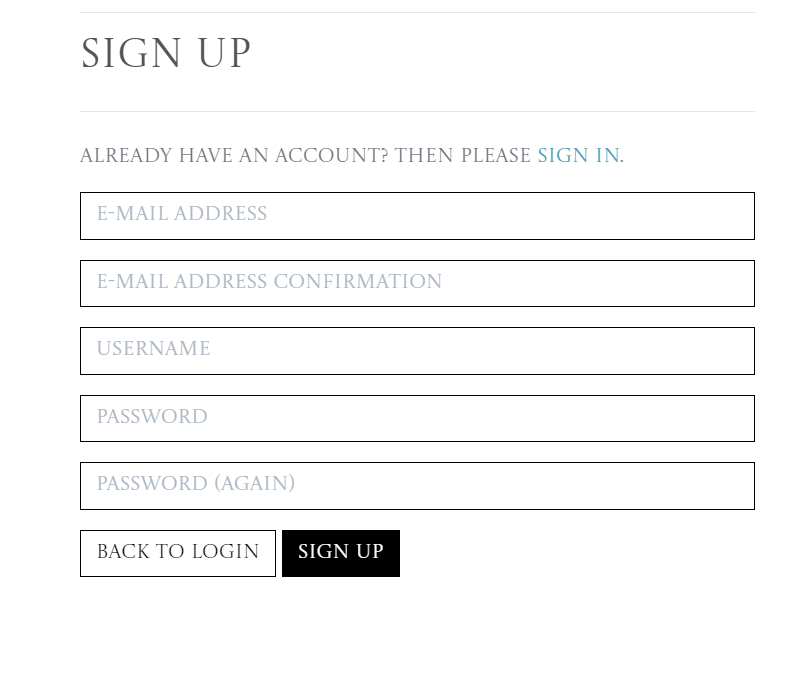
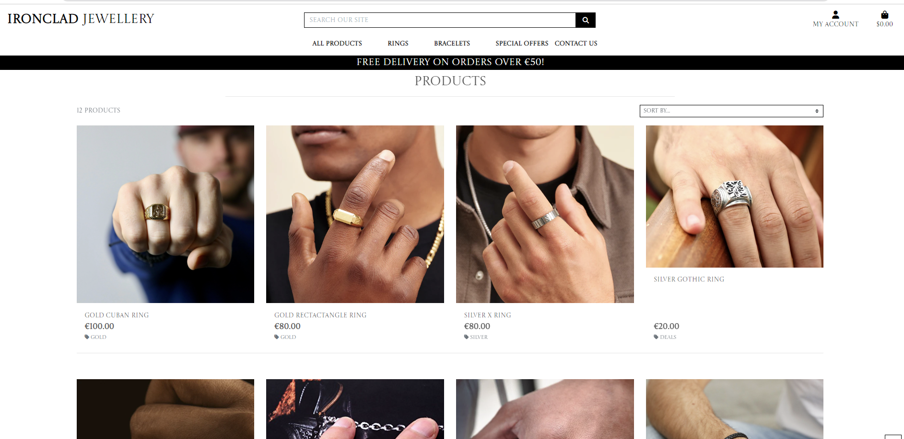

<h1 align="center">Ironclad Jewellery</h1>

### **Live Site**
[Ironclad Jewellery Live Site](https://ironclad-jewellery.herokuapp.com/)

### **Repository:**
[Ironclad Jewellery Repository](https://github.com/Ryan-Martin22/ironclad-jewellery)

# About
This is a full-stack e-commerce project built using Django, Python, HTML, CSS, and JavaScript. I have created this website for 'Ironclad', a business that sells a range
of Men's Jewellery of all differnt stylings, including gold,silver and stainless steel. This site exclusively sells rings and bracelets. 

# User Experience

# Strategy

This website is for a Business to Consumer (B2C) business that sells stylish men's jewellery. The target market for these products are:

- Men who enjoy fashion and in particular, mens's jewellery.
- Those looking for gifts or presents for people who enjoy wearing jewellery.
- Men aged between 15 and 60.

Keeping the above in mind, I believe the Customers will need a website that is:

- Easy to Navigate and filter/search by category.

- Has the ability to view and purchase items.

- Has an email subscription service.

- Has links to Social Media sites Facebook and Instagram.

- User Account functionality, to keep track of order history and store delivery information.

And the Owner will need a website that:

- Appealingly displays their products.

- Allows them to add, edit and remove products.

- Allows customers to get in contact if required through a contact form.

- Allows user to share feedback through reviews on products in order to improve products/service.

# User Stories

Please find my Projects Board with my user stories [here](https://github.com/users/Ryan-Martin22/projects/6). Below is a detailed list of User Stories per User Type.
## Superuser / Admin
1.	As a Site Owner I want to be able to add a product so that I can add more items to my store to increase revenue.
2.	As a Site Owner I want to be able to Edit/Update a product so that I can change the price, description, and other product criteria if any changes were to occur.
3.	As a Site Owner I want to be able to delete a product so that I can remove items that are no longer available.
4.	As a Site Owner I want to be able to send emails to customers with a subscription, notifying customers of any deals, sales, and new arrivals.
5.	As a Site Owner, I want to be able to remove reviews from a product if the review is derogatory to the nature of the site.
6. As a Site Owner I want customers to be able to contact me about any issues by filling out a contact form.  

## Shopper
1.	As a Shopper I want to be able to view a list of items so that I can add them to my basket to purchase.
2.	As a shopper I want to be able to click into an item so that I can view a product description and add it to the basket.
3.	As a shopper I want to be able to add items to my basket so that I can keep track of what I am spending.
4.	As a shopper I want to be able to adjust the quantity of products in my basket so that I can make changes to my purchases before checkout.
5.	As a shopper I want to be able to enter payment information so that I can check out and purchase my product with ease.
6.	As a shopper I want to be able to feel that my personal and payment details are safe and secure so that I can confidently carry out my purchase.
7.	As a shopper I want to be able to view an order confirmation so that I can verify my order is correct.
8.	As a shopper I want to be able to receive an email confirmation of my order so that I have proof of my order for my records in case of any delivery delay.
9.	As a shopper I want to be able to order without creating an account so that I can make one-off orders.
10.	As a shopper I want to be able to sort a specific category of products so that I can find the exact style/type of product that suits me.
11.	As a shopper I want to be able to sort multiple categories and products simultaneously so that I can find the best-priced product over a broader range of categories
12.	As a shopper I want to be able to easily see what I’ve searched for and the number of results so that I can quickly see whether the product is available.
13.	As a shopper I want to be able to easily register for an account so that I can have a personal account and view my profile and purchase history.
14.	As a shopper I want to be able to receive a registration confirmation email so that I can confirm registration.
16.	As a shopper I want to be able to sign up for emails so that I can be notified of new releases, deals, and upcoming sales.
17. As a shopper, I want to be able to be able to contact the site owner so that I can ask about my order or for further information not on the site or social media.
18. As a shopper, I want to be able to be able to review products purchased on the site so I can share my thoughts with other shoppers and the business.
19. As a shopper, I want to be able to be able to edit and remove my reviews of products purchased so I can share or remove my reviews if my opinions change.
20. As a shopper I would like to save items so that I can return to them to purchase later.

# Scope

To achieve the above user and business goals, this project will be created with the following features:

- Site Navigation containing a Search Bar, My Account Links, Shopping Bag links, Contact Us form and Product Categories sections.

- A Landing Page that clearly demonstrates what the site is for.

- A Products Page that lists the Products contained within the category/search carried out.

- Products Cards that gives the user an image of the product along with name, price, and ability to click into it for more details.

- Registration/login functionality using Django AllAuth so that users can create and manage their account.

- A User Profile Page so that users can save delivery details for faster orders in future and to see their order history.

- Custom 404 Error Page

# Structure

This project is structured with a homepage that greets the user with a clear navigation bar at the top of the page to search for the item required or to browse all products. There is the ability to sort items by price, alphabetically, and by category as well as the ability to search for a product by typing keywords into the search bar.

The website is made of the following apps:
1. Home
2. Products
3. Profile
4. Bag
5. Checkout
6. Contact
7. Favourites

## Database Models 

### Category

The Category model is required so that the site owner can assign products to a Category. This model allows for filtering functionality so that shoppers can search for items wanted by item type, new arrivals, clearance, and deals.

### Products
The Products model is required to add products for sale to the site. The site owner only can add, edit, and delete products from here and all users can view the full product list on the site.

### Order & Order Line Items
The Order model holds the order details of an order placed by the shoppers. This is connected to the Order Line Items model which contains the products ordered by the shopper.

### User Profile

The User Profile contains delivery information for those who created an account and chose to store their delivery details for faster checkout.

### Favourites

The Favourites model is required for users to add products to their favourites so they can come back to purchases them later.

### Contact

The Contact model enables users to provide information in order for them to contact the store owner about a specific query. 

### Review 

The reviews database holds all of the reviews submitted by users with an account. Users can submit, edit and delete reviews posted by themselves whilst logged in to their accounts. This is accessible via the Product Details page for the products they have reviewed.

## Wireframes

All wireframes were created using [Balsamiq](https://balsamiq.com/).

Ironclad Jewellery Wireframes for Mobile, Tablet and Desktop devices can be viewed in the wirefames folder within the assets folder. 

# Marketing Strategies

The following questions were asked and answered when trying to decide on the best marketing strategy. 

1.	Which online platforms would you find lots of your users?

- Facebook
- Instagram
- Tiktok
- pinterest
- Twitter

2.	Would your users use social media? If yes, which social media platforms do you think you would find them on?

- Facebook
- Instagram
- Tiktok
- Twitter

3.	What do your users need? Could you meet that need with useful content? If yes, how could you best deliver that content to them?

- Style Inspiration: 
    - Facebook Posts of our jewellery styled and possible combinations with oufits for occasions
    - TikTok Videos following current editing trends
- Gift Inspiration
    - Facebook/Instagram Posts of gift ideas and product combinations
    - Emails with gift ideas, particularly around Fathers Day, Christmas and International Men's Day.

4.	Would your business run sales or offer discounts? How do you think your users would most like to hear about these offers?

- Email deals for subscribers who sign up to the newsletter
- Sale Emails and Facebook Posts/Stories

5.	What are the goals of your business? Which marketing strategies would offer the best ways to meet those goals?

- Make Sales
- Monthy site viewing targets
- Gather repeat customers
- Target of account sign-ups

6.	Would your business have a budget to spend on advertising? Or would it need to work with free or low-cost options to market itself?

- Free/low-cost marketing as the budget would need to go towards aquiring more stock and potentially high end pieces.

I also looked at the below business as they both also sell stylish jewellery for men, Instagram is the most popular site followed by Facebook. 

### Craftd London: 
FB Page 51,703 likes, Instagram 383k followers

### Indigo Sands: 
FB Page 65,036 likes, Instagram 379K followers

### Facebook

### Subscription

Users are also able to subscribe to receive the Clay & Fire Jewellery Newsletter via the Mailchimp form found in the footer. Subscription email would contain Upcoming Sale information and current deals. 

# Features

## Homepage

### Logo / Shop Name

### Search Bar 

### My Account 

### Shopping Bag 

### Bootstrap Toast

### Product Navigation

### Homepage and Delivery Banner

## My Account

### Account Registration

### Login

### My Profile

- Delivery Information

- Order History

- Order Confirmation

### Logout

## Products Page 

## Product Details 

## Product Favourited 

## Product Review

Visable on the bottom of the Product Details Page

## Edit Review Form

## Delete Review Confirmation

## Shopping Bag

## Checkout

## Checkout Success

## Footer

## Company
### About Us

### Privacy Policy

## Contact Form

### Edit Products

### Delete Products

## Colour Scheme 

The colour scheme for the project was put together using [Adobe Color](https://color.adobe.com/create/image) by uploading the landing page image.

The colour scheme is also based of the Boutique Ado walkthrough.

## Font Choice

I chose the Google Font Castoro Titling to act as the primary font for the website, including for the logo.

# Features to be Implemented
The following features can be implemented to enhance the project:

- This weeks featured items for promotion on the homepage
- Implementation of a monthly discount coupon for subscribed shoppers.
- Returns Functionality

# Technologies Used
## Languages Used

[html](https://en.wikipedia.org/wiki/HTML)

[CSS](https://en.wikipedia.org/wiki/CSS)

[Python](https://www.python.org/)

[JavaScript](https://www.javascript.com/)

## Frameworks, Libraries, and Programmes Used 

[GitHub](https://github.com/) - Holds the repository of my project, GitHub connects to GitPod and Heroku.

[GitPod](https://gitpod.io/workspaces) – Connected to GitHub, GitPod hosted the coding space, allowing the project to be built and then committed to the GitHub repository. 

[Heroku](https://www.heroku.com/) - Connected to the GitHub repository, Heroku is a cloud application platform used to deploy this project so the backend language can be utilised/tested. 

[Django](https://www.djangoproject.com/) - This framework was used to build the foundations of this project, reducing time spent getting the project setup and preventing re-writing existing code.

[Bootstrap](https://getbootstrap.com/) - Used to quickly add design and responsiveness to my website, Bootstrap focuses on mobile first design meaning this website is responsive across multiple devices and screen sizes.

[Font Awesome](https://fontawesome.com/) - Used for all of the icons throughout the site.

[Image Compressor](https://imagecompressor.com/) - Used to compress the website and product images.

# Testing
## **Manual Testing by User Story**
### **Superuser / Admin**
### 1. As a Site Owner, I want to be able to add a product so that I can add more items to my store.
- Products can be added both via the project management page found by clicking on 'My Account' or vis the Admin Panel. Both types of product adding were tested and the products were both visable in the model and on the Products Page.

The following was also checked and found to be working as expected when the product was added:

- The required fields are validating correctly and error messages are explicit and related to each required field.
- All required fields are indicated with an asterisk.
- Number fields can only contain numbers.
- Images can be left out and a placeholder image takes its place.
- Images, when uploaded, are stored in the appropriate Amazon Web Services Bucket and Folder.
- Buttons are highlighted on hover and take the user to the correct page:
    - Cancel takes the user back to the Products Page
    - Add product add the product and returns the user to the Products Page
- An alert message appears in the top right of the page to notify the user that the product has successfully been added.

### 2.	As a Site Owner, I want to be able to Edit/Update a product so that I can change the price, description, and other product criteria.

The below was tested by editing an existing product:

- Edit buttons are located on the product cards on the products page which are only accessible if you are a Superuser. 

I also attempted to edit products whilst signed in as a generic user. The edit button on the Product Cards weren't available and I was unable to sign into the Admin Panel.

- Clicking the Edit button takes the user to the product form which is already populated with the current information. I double checked this information matched the product I intended to edit, which it did. 
- The fields are validated the same way as if a new product was being added, all number fields must be numbers and required fields filled in. Error messages appeared as I attempted to input incorrect information and the form would not submit.
- Removing the image was tested and the placeholder image will replaced it upon saving as expected.
- If the image is replaced with a new image it is stored in the correct Amazon Web Services Bucket and Folder.
- The name of the image uploaded can be the same as an image that exists.
- An alert message appears in the top right of the page to notify the user which product they are currently editing. This matched the product name that was populated within the edit form.
- Buttons are highlighted on hover and take the user to the correct page:
    - Cancel takes the user back to the Products Page.
    - Update product saves the updated product information and returns the user to the Products Page. This is confirmed via the admin panel and the details on the Product Details page.

### 3.	As a Site Owner, I want to be able to delete a product so that I can remove items that are no longer available.

The following was tested by deleting a Product via the delete button on the Product Card:
- Clicking delete took the user to a Delete Confirmation Page. 
- Confirming delete removes the product from the product model and is no longer available to buy via the Products Page.
- The user cannot view the product with the URL. Using the link for a product that no longer exists takes the user to a 404 error page.
- A success message at the top right of the page confirms the product is successfully deleted.

### 4.	As a Site Owner, I want to be able to send emails to customers with a subscription, notifying customers of any deals, sale and new arrivals.

- Customers who sign up for emails are added to the business's Mailchimp contacts list where they can be unsubscribed. Users can contact the owner via the 'contact us' form in the footer to unsubscribe. 

This was tested by subscribing with an email and checking the email list on Mailchimp to ensure it was submitted. I also check the unsubscribe functionality to ensure it was easy to remove an email from the email list.

- Unsubscribed users can re-subscribe by submitting their email again. This was tested by unsubscribing an email and then re-subscribing. The re-subscribed email is back in the email list as subscribed.

- An error message is displayed underneath the email box if there is an issue with the email provided. I attempted to subscribe with test@test.com, a message appeared underneath stating that I could not subscribe with this email.
- A success message is displayed underneath the email box to confirm the subscription. I tested this by submitting a valid email that exists. A success message appeared underneath, thanking the user for subscribing.

### 5.	As a Site Owner, I want to be able to remove reviews from the site without deleting them so that they can still be available if required.

- Status Field in Admin Panel

Within the Admin panel, the Superuser is able to remove a review from the site without deleting it by un-ticking the status checkbox within the review. This was tested by un-checking the status box on one of the submitted reviews. I then went to the product the review was for to check whether the review was still posted on the Product Details page. The review was removed without being deleted and the total count of review decreased.

### **Shopper**
### 1. As a Shopper, I want to be able to view a list of items so that I can add them to my basket.

- All products are displayed using Bootstrap Cards and Responsiveness classes to ensure the card layout changes dependant on screen size. I tested this by comparing the model with the products displayed on the site. The number of products matched along with the details of the products listed. 

- Products can be viewed together or by category and can be further filtered using the sort box on the top right of the products pages. This was tested by clicking through each category and sort to check the products listed match the filter that was in place. Categories matched categories without missing items, and the sort filtered the products in the order specified by the user.

- All product images are displayed and where they do not exist there is a placeholder. This was tested by adding a product without an image to see what happens when submitted. The placeholder image was in place as expected and when edited the image was replaced with a product image.

- All products have a required title, price and category attached to the product card. This was tested by trying to submit a new product without this information included individually. When either of these fields are missing, the form validation prevents the form from submitting until the fields are completed.

- Edit and Delete buttons are unavailable to non-superusers. This was tested by signing in as a generic user. When navigating to the products the edit and delete buttons are unavailable and the user was unable to access the Admin Panel to edit/delete the product from there.

###	2. As a shopper, I want to be able to click into an item so that I can view a product description and add to the basket.

I tested this by: 
- Clicking a Product Card. I was taken to the correct item as the product image, title, and price matched the Product Card clicked on. The user can also see the description of the item they are viewing which matched the description in the model for that product. 

### 3. As a shopper, I want to be able to add items to my basket so that I can keep track of what I am spending.

The following scenarios were tested by checking the items added to the Shopping Bag:

- I added an item to the bag and checked the correct product was added.

- I increased the quantity before adding to the shopping bag and checked whether the quantity in the bag matched what was was added.

- I tried to add 0 or a quantity over 99, an error message by the quantity field notifies the user that the quantity can only be between 1-99. If the user uses the buttons rather than typing the quantity, the buttons are disabled if attempting to decrement to 0 or increment above 99. I was unable to add a quantity that wasn't within the specified quantity allowance.

- Once an item has been added to the shopping bag a success message appears in the top right corning, notifying the user of the specific product and quantity added, how much more to spend to save on delivery and a link to the shopping bag. The product in the toast matched the Product Details I was in and the item that was in the shopping bag.

All items were added as they should be to the shopping bag and tested through to order completion to ensure the items added to the shopping bag matched the completed order.

